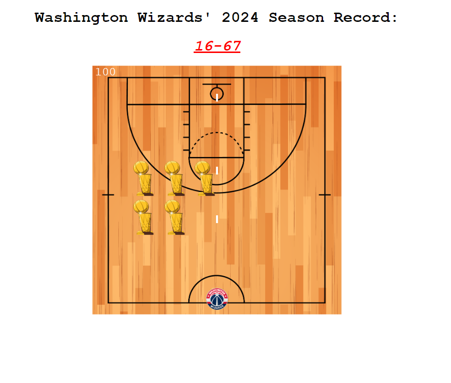

# Washington Wizards Invaders

## About The Project
A space invader game customized to the tune of the Washington Wizards basketball team. User able to move left/right, shoot lazers, elimiate 'invaders'. Score continuously added, game over screen overlayed when invaders take over



### Installation

1. Clone the repo
   ```sh
   git clone https://github.com/Ja-Bril/WashingtonWizardInvaders.git
   ```


## Contact

Diego Abril -  - abrildiego96@gmail.com
Project Link: [https://github.com/Ja-Bril/WashingtonWizardInvaders](https://github.com/Ja-Bril/WashingtonWizardInvaders)


[React.js]: https://img.shields.io/badge/React-20232A?style=for-the-badge&logo=react&logoColor=61DAFB
[React-url]: https://reactjs.org/
Project Link: [https://github.com/Ja-Bril/WashingtonWizardInvaders]

